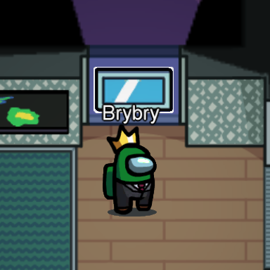

# BetterPolus
An Among Us mod that tweaks Polus, allowing a more balanced experience.

## Features
<ul>
<li><b>Vitals</b> have been moved to <b>Laboratory</b>.<br>
<details>
 <summary><b>Show example</b></summary>
 <p align="center">
    
 </p>
</details></li>

<li>The <b>Reboot Wifi task</b> is now located in the <b>Dropship</b>.<br>
<details>
 <summary><b>Show example</b></summary>
 <p align="center">
    
 </p>
</details></li>

<li>The <b>Chart Course task</b> is now located in <b>Comms</b>.<br>
<details>
 <summary><b>Show example</b></summary>
 <p align="center">
    
 </p>
</details></li>

<li>The <b>Temperature (cold) task</b> is now located <b>Outside (Between O2 & Comms)</b>.<br>
<details>
 <summary><b>Show example</b></summary>
 <p align="center">
    
 </p>
</details></li>

<li>The <b>Vents</b> near both Reactor Pods are <b>not linked to eachother</b> anymore.
<ul>
<li>The Vent <b>on top of Electrical</b> is linked to the Vent <b>on top of Security</b>.<br>
<details>
 <summary><b>Show example</b></summary>
 <p align="center">
    
 </p>
</details></li>

<li>The Vent <b>outside of Laboratory</b> is linked to the Vent <b>inside Storage</b>.<br>
<details>
 <summary><b>Show example</b></summary>
 <p align="center">
    
 </p>
</details></li>
</ul>
</li>
</ul>

## Technology
This mod has been created using **[Reactor Modding Framework](https://github.com/NuclearPowered/Reactor)**. The game is patched at runtime via **[Reactor BepInEx](https://github.com/NuclearPowered/BepInEx)** and no game file is actually altered.

For the moment, this mod supports **Among Us v2020.12.9s** *(Steam version)*.

## Installation
For a better experience, every player in your lobby should download BetterPolus. You *can* play with people that don't have the mod installed but keep in mind that they won't see the same things as you (for example Vitals location).

There are two ways to install the mod :
- **All-in-one pack _(Easiest)_:** The easiest way to install BetterPolus.
- **Custom install _(Advanced/Recommended)_:** Download and install everything by yourself.

### All-in-one pack
1. Download the pack for your game version in the **[Releases section](#releases)** below.
2. Extract the content of the zip file into your game folder (**`Steam/steamapps/common/Among Us`**).
3. Run the game from Steam.

### Custom install
1. Install Reactor BepInEx by following **[these instructions](https://docs.reactor.gg/docs/basic/install_bepinex/)**.
2. Install Reactor by following **[these instructions](https://docs.reactor.gg/docs/basic/install_reactor)**.
3. Download the **dll file** for your game version in the **[Releases section](#releases)** below.
4. Copy the dll file into **`Among Us/BepInEx/plugins`**.
5. (Optional) If you want to play on official servers, you must do the following (**doesn't work anymore since v2021.3.31s**) :
    - Open **`Among us/BepInEx/config/gg.reactor.api.cfg`** with a text editor.
    - Find the line `Modded handshake = true` and change it to `Modded handshake = false`.
    - Save and close your editor.
    
 ## Releases
 | Among Us Version | Mod Version | All-in-one pack | DLL file |
 | ---------------- | ----------- | :-------------: | :------: |
 | v2021.6.30       | Ver. 1.1.3  | **[Download](https://github.com/Brybry16/BetterPolus/releases/download/v1.1.3/BetterPolus_All-in-one-Pack-1.1.3.zip)** | **[Download](https://github.com/Brybry16/BetterPolus/releases/download/v1.1.3/BetterPolus-1.1.3.dll)** |
 | v2021.3.31.3     | Ver. 1.1.2  | **[Download](https://github.com/Brybry16/BetterPolus/releases/download/v1.1.2/BetterPolus_All-in-one-Pack-1.1.2.zip)** | **[Download](https://github.com/Brybry16/BetterPolus/releases/download/v1.1.2/BetterPolus-2021.3.31.3s.dll)** |
 | v2021.3.5s       | Ver. 1.1.1  | **[Download](https://github.com/Brybry16/BetterPolus/releases/download/v1.1.1/BetterPolus_All-in-one-Pack-1.1.1.zip)** | **[Download](https://github.com/Brybry16/BetterPolus/releases/download/v1.1.1/BetterPolus-2021.3.5s.dll)** |
 | v2020.12.9s      | Ver. 1.1    | **[Download](https://github.com/Brybry16/BetterPolus/releases/download/v1.1/BetterPolus_All-in-one-Pack-1.1.zip)**     | **[Download](https://github.com/Brybry16/BetterPolus/releases/download/v1.1/BetterPolus-2020.12.9s.dll)** |
 | v2020.12.9s      | Ver. 1.0    | **[Download](https://github.com/Brybry16/BetterPolus/releases/download/v1.0.0/BetterPolus_All-in-one-Pack.zip)**       | **[Download](https://github.com/Brybry16/BetterPolus/releases/download/v1.0.0/BetterPolus-2020.12.9s.dll)** |
 
 ### Changelog
 <details>
  <summary>Version 1.1.3</summary>
  <ul>
     <li>Added compatibility with Among Us v2021.6.30s</li>
  </ul>
  </details>

 <details>
  <summary>Version 1.1.2</summary>
  <ul>
     <li>Added compatibility with Among Us v2021.3.31.3s</li>
  </ul>
  </details>

 <details>
  <summary>Version 1.1.1</summary>
  <ul>
     <li>Added compatibility with Among Us v2021.3.5</li>
  </ul>
  </details>
  
  <details>
   <summary>Version 1.1</summary>
   <ul>
      <li>Fixed Crewmates being able to access Chart Course Task from outside of Comms.</li>
      <li>Moved Temperature (cold) task to the 'Death Valley' (Outside, between Comms & O2).</li>
      <li>Moved Vitals where Temperature (cold) was originally (in Laboratory).</li>
   </ul>
   </details>
 
 <details>
 <summary>Version 1.0</summary>
 <ul>
    <li>Vitals have been moved to Laboratory.</li>
    <li>The Reboot Wifi task is now located in the Dropship.</li>
    <li>The Chart Course task is now located in Comms.</li>
    <li>The Vents near both Reactor Pods are not linked to each other anymore.
        <ul>
            <li>The Vent on top of Electrical is linked to the Vent on top of Security.</li>
            <li>The Vent outside of Laboratory is linked to the Vent inside Storage.</li>
        </ul>
    </li>
 </ul>
 </details>   
 
 ## Uninstall
 ### Uninstall BetterPolus
 To uninstall BetterPolus, simply delete the BetterPolus dll file from **`Among Us/BepInEx/plugins`**.
 
 ### Uninstall Reactor/BepInEx
 To completely uninstall everything, either uninstall/reinstall the game from steam or remove the following files and directories :
 ```
-- BepInEx/
-- mono/
-- changelog.txt
-- doorstop_config.ini
-- steam_appid.txt
-- winhttp.dll
```

## Q&A
**How do I know if BetterPolus is correctly installed?**<br>
Just check that there is a line saying that BetterPolus has been loaded in the top left of the main menu.

**Does this works with (Better-)CrewLink (Proximity Chat)?**<br>
Of course!

**Do I risk anything if I play on official Servers?**<br>
There is currently no permaban system for the game so it's safe to play on official servers. However, I still recommend you to host your own custom server to be safe. For more information, you can check these repositories :
- **[Impostor/Impostor](https://github.com/Impostor/Impostor):** A custom server that allows you to create your own plugins.
- **[NuclearPowered/Impostor](https://github.com/NuclearPowered/Impostor):** Impostor but maintained by the team behind Reactor. <ins>Use this if you want to play with plugins that need Reactor's Custom RPC API or Modded Handshake.</ins>

**Can you use BetterPolus with Woodi's Sheriff Mod?**<br>
Reactor doesn't support Woodi's Sheriff Mod. **However**, you can use [**Reactor-Sheriff**](https://github.com/Brybry16/Reactor-Sheriff) which is an adapted version of Woodi's Sheriff Mod that can run with and BetterPolus.

**How can I get started at Among Us Modding?**<br>
Look at the **[Reactor documentation](https://docs.reactor.gg/)** to get started, and join **[Reactor's Discord](https://discord.gg/Zcmsb9UGuq)** to get more help from the community.

## Licensing
BetterPolus is distrbuted under the **[MIT License](LICENSE)**. While you don't have to credit me if you use or modify this mod, it's greatly appreciated!<br>
[BepInEx](https://github.com/BepInEx/BepInEx) is distributed under the **LGPL-2.1 License**.

*This mod is not affiliated with Among Us or Innersloth LLC, and the content contained therein is not endorsed or otherwise sponsored by Innersloth LLC. Portions of the materials contained herein are property of Innersloth LLC. © Innersloth LLC.*
